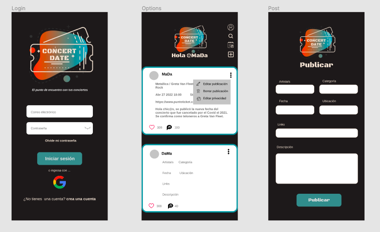

  

_______________
# **Concert Date**

## **Investigación y diseño.**

Concert Date es un nuevo punto de encuentro para aquellas personas que disfrutan de la música y los conciertos. Esta red social busca generar una instancia para compartir los mejores datos de conciertos y/o festivales de música. En ella podrás encontrar eventos por artista, fecha, estilo de música y ubicación, para no pederte ninguno.

Esta red social está pensada y diseñada para amantes de la música que deseen encontrar y organizar sus mejores eventos musicales.

Descubre [Concert Date] en (https://danicastro-developer.github.io/SCL018-social-network/src/index.html#/login).

### *Prototipos en papel*.

    

### *Prototipo de alta fidelidad.*
Nuestro prototipo de alta fidelidad fue realizado en Figma, donde desarrollamos varias ideas de diseño optando al final por la que más adeptos tuvo en la etapa de feedback. Las decisiones de diseño fue pensadas para celular, considerando que es el medio más usado para ingresar a redes sociales. 

Puedes revisar los prototipos en [Figma.](https://www.figma.com/file/9YjswY4QEgzAftI3UUbDlB/Red-social---ConcertDate?node-id=0%3A1)

  

_________________
## **Responsive.**
Nuestra red social está pensada para usar principalmente en celulares, pero es adaptable a pantalla de escritorio.

*Vista en celular*

*Vista en escritorio*

 

_____________________

## **Historias de Usuario.**
En base a las historias de usuarios fue como definimos la dirección de nuestro proyecto y las prioridades en cuanto al desarrollo de la página.

 

_____________________

## **Test de usabilidad.**

Comming soon

